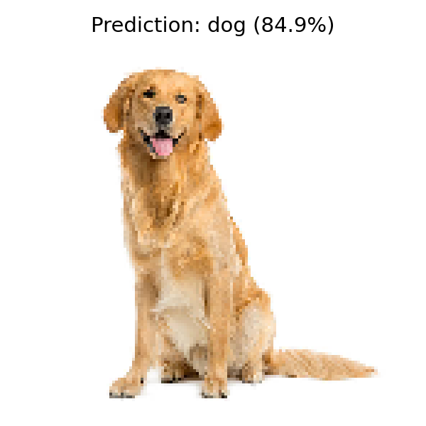

## 과제1. MNIST 손글씨 숫자 분류

### 1. 문제 정의
- MNIST 데이터셋의 손글씨 숫자 이미지를 입력받아 0부터 9까지의 숫자를 분류하는 간단한 이미지 분류기를 구현한다.
- 28x28 크기의 흑백 이미지를 학습 데이터와 테스트 데이터로 나누어 학습하고, 최종 정확도를 평가한다.

### 2. 주요 기능
- MNIST 데이터셋 로드
- 학습 세트와 테스트 세트 분할
- 픽셀 값 정규화
- Sequential 기반의 간단한 완전연결 신경망 구성
- 모델 학습 및 테스트 정확도 평가

### 3. 핵심 코드 설명
- 데이터 로드와 정규화
```python
from tensorflow.keras.datasets import mnist
from tensorflow.keras.models import Sequential
from tensorflow.keras.layers import Dense, Flatten

(x_train, y_train), (x_test, y_test) = mnist.load_data()

x_train = x_train / 255.0
x_test  = x_test  / 255.0
```
- MNIST 데이터를 불러온 뒤, 픽셀 값을 0~1 범위로 정규화하여 학습 효율을 높인다.

- 모델 구성
```python
model = Sequential([
    Flatten(input_shape=(28, 28)),
    Dense(128, activation='relu'),
    Dense(64, activation='relu'),
    Dense(10, activation='softmax'),
])
```
- 28x28 이미지를 1차원 벡터로 펼친 다음, 두 개의 은닉층과 10개 클래스 출력을 가진 분류 모델을 만든다.

- 모델 컴파일과 학습
```python
model.compile(
    optimizer='adam',
    loss='sparse_categorical_crossentropy',
    metrics=['accuracy']
)

history = model.fit(
    x_train, y_train,
    batch_size=32,
    epochs=5,
    validation_data=(x_test, y_test)
)
```
- Adam 옵티마이저와 다중 분류 손실 함수를 사용해 학습하고, 테스트 세트로 검증한다.

- 성능 평가
```python
test_loss, test_accuracy = model.evaluate(x_test, y_test, verbose=0)
print(f"\n테스트 정확도: {test_accuracy:.4f} ({test_accuracy * 100:.2f}%)")
```
- 학습이 끝난 후 테스트 세트 기준 정확도를 출력한다.

### 4. 실행 방법
- 작업 폴더를 `c:\smkim`으로 두고 실행한다. 이 스크립트는 상대 경로를 기준으로 동작한다.
- 필요한 패키지를 설치한다.
```bash
pip install tensorflow
```
- 과제1 스크립트를 실행한다.
```bash
python chapter5_0402/과제1/mnist_classification.py
```
- 실행 결과로 모델 요약과 학습 과정, 최종 테스트 정확도가 출력된다.

### 5. 실행 결과


---

## 과제2. CIFAR-10 CNN 이미지 분류

### 1. 문제 정의
- CIFAR-10 데이터셋을 사용하여 합성곱 신경망(CNN) 기반 이미지 분류기를 구현한다.
- 10개 클래스 이미지를 분류하고, 테스트 이미지인 `dog.jpg`에 대한 예측 결과를 확인한다.

### 2. 주요 기능
- CIFAR-10 데이터셋 로드
- 이미지 데이터 정규화
- CNN 모델 설계 및 학습
- 조기 종료와 학습률 감소 콜백 적용
- 테스트 세트 성능 평가
- `dog.jpg` 이미지 예측 및 결과 시각화

### 3. 핵심 코드 설명
- 데이터 로드와 전처리
```python
from keras.datasets import cifar10

(x_train, y_train), (x_test, y_test) = cifar10.load_data()

x_train = x_train.astype('float32') / 255.0
x_test  = x_test.astype('float32')  / 255.0
```
- CIFAR-10 데이터를 불러온 뒤, 픽셀 값을 0~1 범위로 정규화하여 학습 안정성을 높인다.

- CNN 모델 구성
```python
model = models.Sequential([

    # ── 첫 번째 합성곱 블록 ──────────────────────────────────
    # 32개의 3×3 필터로 특징 맵 추출, 입력 shape=(32, 32, 3)
    layers.Conv2D(32, (3, 3), activation='relu', padding='same',
                  input_shape=(32, 32, 3)),
    layers.BatchNormalization(),
    layers.Conv2D(32, (3, 3), activation='relu', padding='same'),
    layers.MaxPooling2D((2, 2)),
    layers.Dropout(0.25),

    # ── 두 번째 합성곱 블록 ──────────────────────────────────
    # 64개의 3×3 필터로 중간 수준 특징 추출
    layers.Conv2D(64, (3, 3), activation='relu', padding='same'),
    layers.BatchNormalization(),
    layers.MaxPooling2D((2, 2)),
    layers.Dropout(0.25),

    # ── 완전 연결(분류) 블록 ─────────────────────────────────
    layers.Flatten(),
    # 분류기 크기를 줄여 과적합과 학습 편차를 완화
    layers.Dense(256, activation='relu'),
    layers.BatchNormalization(),
    layers.Dropout(0.4),
    layers.Dense(10, activation='softmax'),
])
```
- 합성곱 블록을 여러 단계로 쌓아 이미지의 저수준 특징부터 고수준 특징까지 추출한다.
- MaxPooling2D와 Dropout을 사용해 과적합을 줄이고 일반화 성능을 높인다.

- 학습 제어 콜백
```python
early_stopping = tf.keras.callbacks.EarlyStopping(
    monitor='val_loss', patience=5, restore_best_weights=True
)
reduce_lr = tf.keras.callbacks.ReduceLROnPlateau(
    monitor='val_loss', factor=0.5, patience=3, min_lr=1e-6
)
```
- 검증 손실이 개선되지 않으면 조기 종료하고, 필요 시 학습률을 자동으로 낮춘다.

- 테스트 이미지 예측
```python
img_path = 'chapter5_0402/dog.jpg'

if os.path.exists(img_path):
    img = load_img(img_path, target_size=(32, 32))
    img_array = img_to_array(img)
    img_array = img_array / 255.0
    img_array = np.expand_dims(img_array, axis=0)

    predictions = model.predict(img_array)
    predicted_index = np.argmax(predictions[0])
    predicted_class = class_names[predicted_index]
```
- `dog.jpg`를 32x32 크기로 맞춘 뒤 모델에 입력하고, 가장 높은 확률의 클래스를 최종 예측값으로 사용한다.

### 4. 실행 방법
- 작업 폴더를 `c:\smkim`으로 두고 실행한다. `dog.jpg` 경로가 `chapter5_0402/dog.jpg`로 지정되어 있기 때문이다.
- 필요한 패키지를 설치한다.
```bash
pip install tensorflow numpy matplotlib
```
- 과제2 스크립트를 실행한다.
```bash
python chapter5_0402/과제2/CIFAR-10_CNN.py
```
- 실행 후 학습 정확도, 테스트 정확도, `dog.jpg` 예측 결과가 출력되며, 학습 곡선과 예측 결과 이미지는 현재 작업 폴더에 저장된다.

### 5. 실행 결과


